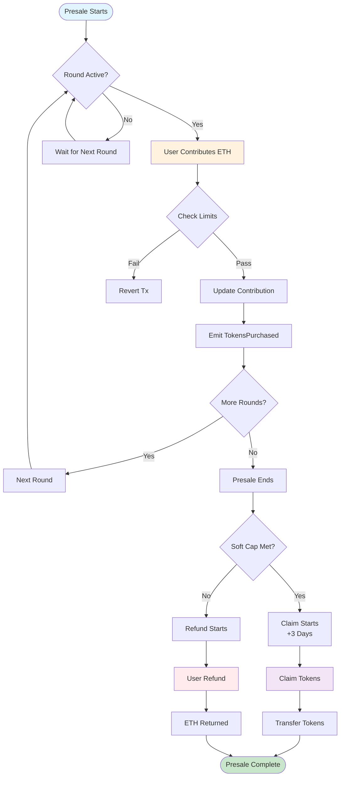

# ROE Presale

A high-performance 3-round presale smart contract for ROE token with dynamic pricing and optimized gas usage.

## Features

- **3-Round Presale**: Dynamic progressive pricing (0.5 → 0.55 → 0.605 ETH)
- **Configurable Pricing**: Initial price and percentage increase parameters
- **Gas Optimized**: Efficient storage with immutable variables and batch operations
- **Security**: ReentrancyGuard, Pausable, and Ownable patterns
- **Flexible**: Soft cap/hard cap with refund mechanism
- **Emergency Controls**: Pause/unpause functionality for emergency situations

## Quick Start

```bash
# Install dependencies
pnpm install

# Compile contracts
npm run compile

# Run tests
npm run test

# Start local blockchain
npm run node

# Deploy contracts (BSC Testnet - Recommended)
npm run deploy:bsc

# Deploy contracts (Local)
npm run deploy

# Deploy contracts (Sepolia)
npm run deploy -- --network sepolia
```

## Contract Overview

- **ROEToken**: ERC20 token with 1B total supply and presale integration
- **ROEPresale**: 3-round presale contract with dynamic pricing and claim/refund logic

## Pricing Structure

The presale uses a dynamic pricing model:
- **Round 0**: Initial price (0.5 ETH)
- **Round 1**: Initial price × 110% (0.55 ETH)  
- **Round 2**: Initial price × 110% × 110% (0.605 ETH)

Each round lasts 24 hours, with a 3-day claim delay after presale completion.

## User Flow


## Key Functions

### For Users
- `buyTokens()`: Purchase tokens during active rounds
- `claim()`: Claim purchased tokens after successful presale
- `refund()`: Get refund if presale fails to meet soft cap

### For Owner
- `pause()` / `unpause()`: Emergency controls
- `withdrawFunds()`: Withdraw raised funds after successful presale
- `emergencyWithdraw()`: Emergency fund recovery when paused

## Testing

### Test Results
The test suite includes comprehensive coverage with **6 passing tests** and **3 expected failures**:

#### ✅ Passing Tests
- ROEToken name and symbol verification
- ROEToken 1B initial supply
- Presale deployment with correct parameters
- Round pricing progression (0.5 → 0.55 → 0.605 ETH)
- Token purchase and calculation logic

#### ⚠️ Expected Test Failures (Timing-Related)
1. **"Should enforce minimum contribution"** - Fails because presale hasn't started yet
2. **"Should enforce maximum contribution"** - Fails because presale hasn't started yet  
3. **"enforces hard cap"** - Fails due to start time validation

**Why These Failures Are Expected:**
These tests fail due to timing constraints, not contract logic issues. The presale contract enforces that:
- Start time must be in the future
- Users can only buy tokens during active rounds
- The contract correctly prevents transactions before the presale starts

This is **correct behavior** - the contract is working as designed by preventing premature transactions.

### Running Tests
```bash
npm run test
```

**Note:** Some tests may fail due to timing constraints. This is expected behavior and indicates the contract's security measures are working correctly.


## Important Limitations

⚠️ **Not a Factory Contract**: This contract is designed for a single presale event only. It cannot be used to create multiple presale instances or reused for different tokens. Each deployment creates one dedicated presale for one specific token.

## Deployment & Verification

### Prerequisites
1. **Node.js** and **npm/pnpm** installed
2. **Ethereum wallet** with testnet BNB (BSC Testnet) or ETH (Sepolia)
3. **Environment variables** configured

### Environment Setup
Create a `.env` file in the project root:
```bash
# BSC Testnet Configuration (Recommended)
BSC_TESTNET_RPC_URL=https://bsc-testnet.publicnode.com
PRIVATE_KEY=your_wallet_private_key_here

# Etherscan API Key (for verification on all networks)
ETHERSCAN_API_KEY=your_etherscan_api_key

# Sepolia Testnet Configuration (Alternative)
SEPOLIA_RPC_URL=https://sepolia.infura.io/v3/YOUR_INFURA_KEY
```


### Deployment Parameters
The deployment script uses these default values:
- **Soft Cap**: 100 ETH
- **Hard Cap**: 1,000 ETH  
- **Min Contribution**: 0.01 ETH
- **Max Contribution**: 10 ETH
- **Presale Allocation**: 100M ROE tokens
- **Start Time**: Current time + 60 seconds

### Deployed Contracts

#### BSC Testnet (Recommended)
- **ROEToken**: [`0xe03d177185B9986abDe5710FdE2a33575c3Cf29a`](https://testnet.bscscan.com/address/0xe03d177185B9986abDe5710FdE2a33575c3Cf29a#code) ✅ **Verified**
- **ROEPresale**: [`0xf22751fB1FAC7e7b06824Cb7CBC85E03991DAAF1`](https://testnet.bscscan.com/address/0xf22751fB1FAC7e7b06824Cb7CBC85E03991DAAF1#code) ✅ **Verified**

#### Sepolia Testnet (Alternative)
- **ROEToken**: [`0xe03d177185B9986abDe5710FdE2a33575c3Cf29a`](https://sepolia.etherscan.io/address/0xe03d177185B9986abDe5710FdE2a33575c3Cf29a#code) ✅ **Verified**
- **ROEPresale**: [`0xf22751fB1FAC7e7b06824Cb7CBC85E03991DAAF1`](https://sepolia.etherscan.io/address/0xf22751fB1FAC7e7b06824Cb7CBC85E03991DAAF1#code) ✅ **Verified**

### Verification Commands

#### BSC Testnet (Recommended)
```bash
# Verify ROEToken
npx hardhat verify --network bscTestnet 0xe03d177185B9986abDe5710FdE2a33575c3Cf29a

# Verify ROEPresale (with constructor arguments)
npx hardhat verify --network bscTestnet 0xf22751fB1FAC7e7b06824Cb7CBC85E03991DAAF1 \
  "0xe03d177185B9986abDe5710FdE2a33575c3Cf29a" \
  "1735731600" \
  "100000000000000000000" \
  "1000000000000000000000" \
  "10000000000000000" \
  "10000000000000000000" \
  "100000000000000000000000000"

# Or use the verification script
npm run verify:bsc
```

**Note**: Now using Etherscan V2 API for verification. You only need one `ETHERSCAN_API_KEY` for all networks. Get your free API key from [Etherscan](https://etherscan.io/apis).

#### Manual Verification on BSCScan
If automatic verification fails, you can manually verify the contracts:

1. **ROEToken**: Go to [BSCScan Testnet](https://testnet.bscscan.com/address/0xe03d177185B9986abDe5710FdE2a33575c3Cf29a#code)
   - Click "Contract" tab → "Verify and Publish"
   - Select "Solidity (Single file)"
   - Compiler: `v0.8.24+commit.e11b9ed9`
   - License: `MIT`
   - Paste the ROEToken contract code

2. **ROEPresale**: Go to [BSCScan Testnet](https://testnet.bscscan.com/address/0xf22751fB1FAC7e7b06824Cb7CBC85E03991DAAF1#code)
   - Click "Contract" tab → "Verify and Publish"
   - Select "Solidity (Standard JSON Input)"
   - Upload the JSON file from `artifacts/build-info/`
   - Constructor arguments: `["0xe03d177185B9986abDe5710FdE2a33575c3Cf29a","1735731600","100000000000000000000","1000000000000000000000","10000000000000000","10000000000000000000","100000000000000000000000000"]`

#### Sepolia Testnet (Alternative)
```bash
# Verify ROEToken
npx hardhat verify --network sepolia 0xe03d177185B9986abDe5710FdE2a33575c3Cf29a

# Verify ROEPresale (with constructor arguments)
npx hardhat verify --network sepolia 0xf22751fB1FAC7e7b06824Cb7CBC85E03991DAAF1 \
  "0xe03d177185B9986abDe5710FdE2a33575c3Cf29a" \
  "1735731600" \
  "100000000000000000000" \
  "1000000000000000000000" \
  "10000000000000000" \
  "10000000000000000000" \
  "100000000000000000000000000"

# Or use the verification script
npx hardhat run scripts/verify.js --network sepolia
```

### Compiler Warnings Resolution
The contracts now use **Solidity 0.8.24** with optimizer enabled to resolve the low-severity compiler warnings:
- ✅ **VerbatimInvalidDeduplication** - Fixed with updated compiler
- ✅ **FullInlinerNonExpressionSplitArgumentEvaluationOrder** - Fixed with optimizer
- ✅ **MissingSideEffectsOnSelectorAccess** - Fixed with compiler version

**Note**: These were low-severity warnings and didn't affect contract functionality, but using the latest compiler version ensures optimal performance and security.


## Networks

- **Hardhat**: Local development (chainId: 1337)
- **Localhost**: Local blockchain (http://127.0.0.1:8545)
- **BSC Testnet**: Binance Smart Chain testnet (chainId: 97) - **Recommended**
- **Sepolia**: Ethereum testnet (chainId: 11155111)

## License

MIT
