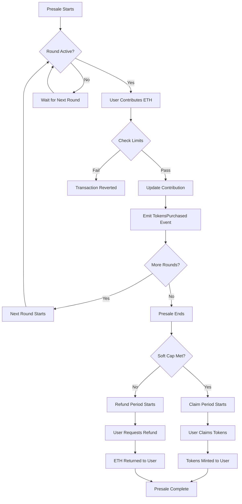

# ROE Presale

A high-performance 3-round presale smart contract for ROE token with dynamic pricing and optimized gas usage.

## Features

- **3-Round Presale**: Dynamic progressive pricing (0.5 → 0.55 → 0.605 ETH)
- **Configurable Pricing**: Initial price and percentage increase parameters
- **Gas Optimized**: Efficient storage with immutable variables and batch operations
- **Security**: ReentrancyGuard, Pausable, and Ownable patterns
- **Flexible**: Soft cap/hard cap with refund mechanism
- **Emergency Controls**: Pause/unpause functionality for emergency situations

## Quick Start

```bash
# Install dependencies
pnpm install

# Compile contracts
npm run compile

# Run tests
npm run test

# Start local blockchain
npm run node

# Deploy contracts
npm run deploy
```

## Contract Overview

- **ROEToken**: ERC20 token with 1B total supply and presale integration
- **ROEPresale**: 3-round presale contract with dynamic pricing and claim/refund logic

## Pricing Structure

The presale uses a dynamic pricing model:
- **Round 0**: Initial price (0.5 ETH)
- **Round 1**: Initial price × 110% (0.55 ETH)  
- **Round 2**: Initial price × 110% × 110% (0.605 ETH)

Each round lasts 24 hours, with a 3-day claim delay after presale completion.

## User Flow



## Key Functions

### For Users
- `buyTokens()`: Purchase tokens during active rounds
- `claim()`: Claim purchased tokens after successful presale
- `refund()`: Get refund if presale fails to meet soft cap

### For Owner
- `pause()` / `unpause()`: Emergency controls
- `withdrawFunds()`: Withdraw raised funds after successful presale
- `emergencyWithdraw()`: Emergency fund recovery when paused

## Important Limitations

⚠️ **Not a Factory Contract**: This contract is designed for a single presale event only. It cannot be used to create multiple presale instances or reused for different tokens. Each deployment creates one dedicated presale for one specific token.

## Networks

- Hardhat (local development)
- Localhost  
- Sepolia (testnet)

## License

MIT
